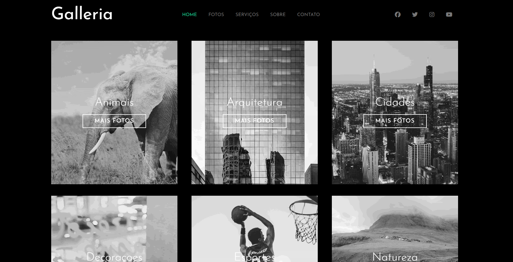

### Galleria - com SASS
Projeto construído com o SASS.

Ultilizei o vídeo [Aprenda SASS em 1 hora](https://youtu.be/Wo5t3uUV8n4?si=fBOnLc2or2INGo44) na construção do projeto Galleria, porém, adaptei á forma mais atual de usar o SASS com o SCSS.

## Preview

## Aprendizados

- sintaxe e estrutura do SASS;
- como usar váriaveis, mixins/funções, nested selectors;
- organização do projeto em pastas para facilitar manutenção.

## Fontes

- [Aprenda SASS em 1 hora](https://youtu.be/Wo5t3uUV8n4?si=fBOnLc2or2INGo44);
- [Aprenda SASS em 25 minutos](https://youtu.be/1F2jqH-d7bw?si=t-x6PHCul4S22S8D);
- [@mixin and @include](https://sass-lang.com/documentation/at-rules/mixin/).

## Ferramentas ultilizadas 

- Extensão Live Sass Compiler - Glenn Marks;
- Extensão Sass (.sass only) - Syler;
- IDE Visual Studio Code.